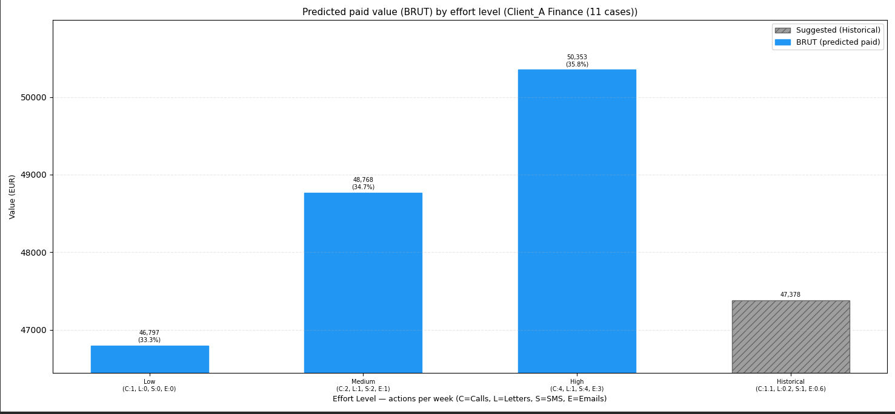
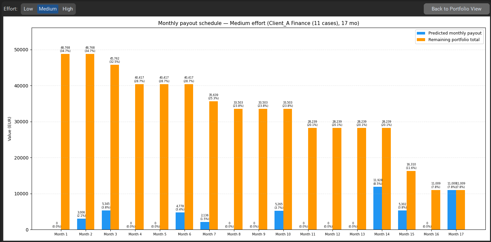
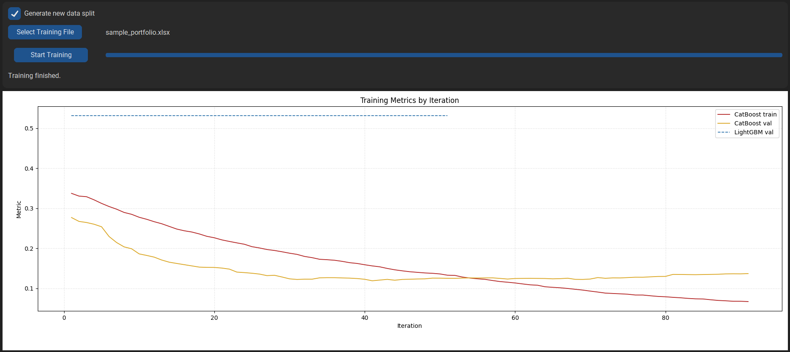
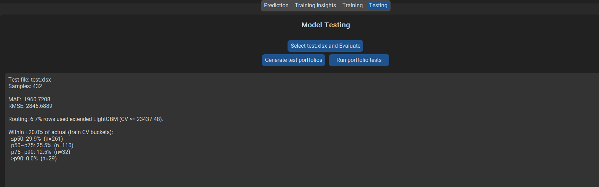

# Debt Collection Portfolio Strategy Engine

A **Python machine learning application** for predicting debt collection outcomes and comparing collection strategies. The system uses **gradient boosting** (blended **CatBoost** median paid model + routed **LightGBM** on high Case Value rows, plus an optional **multi-output GBM** for weekly actions) trained on historical data. The GUI simulates **Low / Medium / High** effort and a **Historical** scenario on uploaded portfolios.

> **Public demo repository.** This version contains **synthetic sample data** and **generic client names** only. Demo trained model artifacts are included in `models/`, and preview screenshots are available in `data/preview/`. Copy `users.json.example` to `users.json` and set your own credentials before use.

## Preview


 



**End-user guide:** see [`user_guide.md`](user_guide.md).

---

## Application overview

| Tab | Role |
|-----|------|
| **Prediction** | Upload portfolio, configure effort, run simulation, bar chart with recovery rates |
| **Training Insights** | Training-set statistics and effort-bucket analysis |
| **Training** (admin) | Retrain GBM models and preprocessing artifacts |
| **Testing** (admin) | Evaluate models on held-out or custom files |

---

## Getting started

### Installation

```powershell
git clone <your-repo-url>
cd portfolio-strategy-engine
python -m venv .venv
.venv\Scripts\Activate.ps1
pip install -r requirements.txt
```

**Note:** `torch` / `torchvision` / `torchaudio` are listed as **optional** in `requirements.txt` (legacy NN code in `train.py` / `benchmark/`). Default **GBM training and simulation** do not require PyTorch.

### Generate demo data (if needed)

```bash
python scripts/generate_sample_data.py
```

### Train models

If `models/` already contains pretrained artifacts, you can skip this step and launch the app directly. Otherwise:
1. Launch the app (see below).
2. Log in as **admin** (see `users.json.example`).
3. Open the **Training** tab and run training on the synthetic splits in `data/train`, `data/valid`, `data/test`.

Or use your own sanitized portfolio file via the Training tab split workflow.

### Launch

```bash
python launcher.py
```

### Login

- **Admin:** Prediction, Training Insights, Training, Testing
- **User:** Prediction and Training Insights

Copy `users.json.example` to `users.json` and change the default passwords.

---

## Prediction / strategy workflow

1. **Upload** portfolio (`.xlsx`, `.xls`, `.csv`) — try `data/sample_portfolio.xlsx`
2. **Baseline = Default** (recommended): after upload, baseline fields show **portfolio average actions per week**
3. Set **Change %** and optional **Target Paid Value**
4. **Run Strategy Simulation**
5. Interpret bar chart (EUR + recovery % for Low/Medium/High)
6. Filter by **Client** / **Import** as needed

---

## What is excluded from this public repo

| Excluded | Reason |
|----------|--------|
| Real portfolio Excel/CSV files | Client confidentiality |
| Demo-trained `models/*` artifacts | Included for prediction demo and ready for use; retrain locally if you want fresh artifacts |
| Company logo / internal docs | Branding and internal procedures |
| `users.json` (committed as `.example` only) | Avoid publishing credentials |
| Benchmark output JSON | Derived from production data runs |

---

## Project structure

```
.
├── launcher.py
├── gui.py
├── predict.py
├── gbm_inference.py
├── split.py
├── train.py
├── test.py
├── config.json
├── users.json.example
├── scripts/
│   ├── generate_sample_data.py
│   └── generate_test_portfolios.py
├── data/
│   ├── train/ valid/ test/
│   ├── preview/          # UI screenshot previews
│   └── sample_portfolio.xlsx
└── models/              # Demo-trained artifacts are included for prediction
```

---

## License

Personal portfolio project. Use and adapt for learning; do not redistribute proprietary data from your employer.

**Version:** 3.1 (public demo)  
**Last updated:** June 2026
